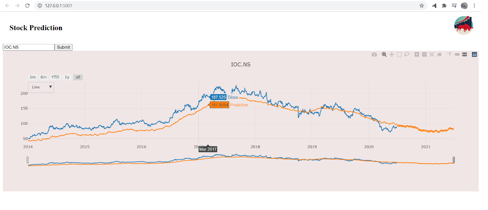

# Stock Prediction App

Simple stock predictionapplication to demonstrate prediction using fbprophet and integrating dash core components and http requests. 




[](https://www.youtube.com/watch?v=tt96f5L5u4c)

# Contents

* ```app.py``` - Front and back end portion of the web application excluding css and static data
* ```Assets Folder```  - css files and static images
* ```models``` - it contains script for extarcting data from yahoo finannce and fbprophet prediction.
* ```src```- conatins stock file extracted from yahoo finance
* ```out```- contains final predicton file.

# Installation

* Download the entire repository as a folder and open ```app.py``` and run it with IDE . That's it!
   http://127.0.0.1:5001/
   
# Source: 
 *  https://dash.plotly.com/basic-callbacks
 *  https://finance.yahoo.com/lookup/
 *  https://pypi.org/project/fbprophet/


